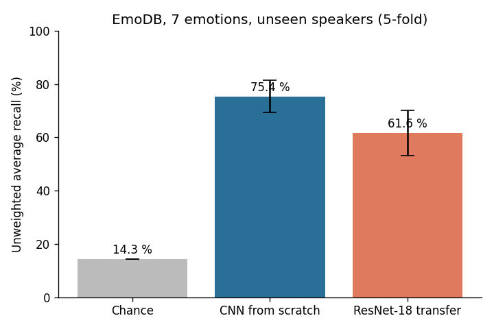
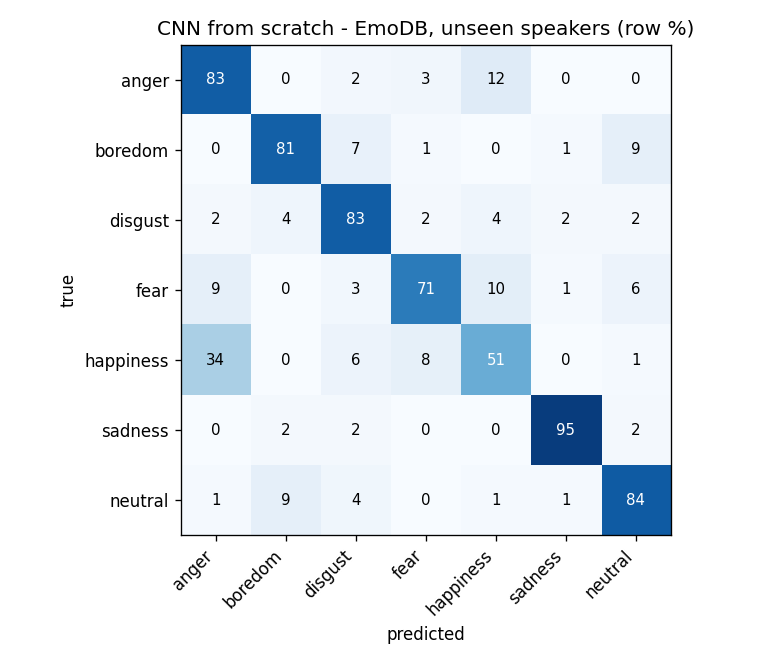

# Voice Emotion CNN

Speech emotion recognition with convolutional neural networks. RO11 course assignment, due 29/09/2026.

- **Live app:** https://huggingface.co/spaces/Yugo-Duyeu/voice-emotion-cnn
- **Repository:** https://github.com/hugodurieux/voice-emotion-cnn

Record a sentence in the browser. The app shows its waveform and log-mel spectrogram and gives a prediction from two CNNs: one trained from scratch and one using transfer learning. Both were evaluated on speakers they never heard during training.

## Data

We use **EmoDB** (Berlin Database of Emotional Speech, German, [emodb.bilderbar.info](http://emodb.bilderbar.info)). It has 535 acted clips from 10 speakers (5 male, 5 female) in 7 classes: anger, boredom, disgust, fear, happiness, sadness and neutral. We picked it because it is small enough to train on a laptop CPU.

| anger | boredom | disgust | fear | happiness | sadness | neutral |
|---|---|---|---|---|---|---|
| 127 | 81 | 46 | 69 | 71 | 62 | 79 |

## Method

**Features** (`features.py`)
- Audio is resampled to 16 kHz mono and leading and trailing silence is trimmed.
- The signal is then cropped or zero-padded to a 3-second window.
- The log-mel spectrogram uses 25 ms frames every 10 ms and 64 mel bands, in dB, standardised per clip. That gives a 64 × 301 image.

**Model 1: CNN from scratch** (`models.ScratchCNN`, 99 k parameters)
- 4 blocks of conv 3×3, BatchNorm, ReLU and 2×2 max-pool, with 16 → 32 → 64 → 128 channels.
- Global average pooling, dropout 0.3, then one fully connected layer with 7 outputs.
- Training: AdamW with a one-cycle LR schedule, 40 epochs, class-weighted cross-entropy.
- Augmentation: a random time shift of the clip inside the 3 s window, plus SpecAugment (one frequency mask and one time mask).

**Model 2: transfer learning** (`models.ResNetEmbedder` + `transfer_head`)
- ResNet-18 pretrained on ImageNet, frozen. The spectrogram is rescaled to [0, 1], copied into 3 channels and normalised with ImageNet statistics.
- The backbone gives a 512-d embedding. Only a new dropout + linear head (3.6 k parameters) is trained, for 200 epochs with class-weighted cross-entropy.
- The embeddings are computed once, so training the head takes a few seconds on a CPU.

**Evaluation: speaker-independent** (`train.py`)

We use leave-2-speakers-out cross-validation with 5 folds. Each fold holds out one male and one female speaker: (03, 08), (10, 09), (11, 13), (12, 14), (15, 16). No speaker ever appears in both training and test, and the code checks this with an `assert`. The main metric is **unweighted average recall (UAR)**, i.e. balanced accuracy, because the classes are imbalanced. After cross-validation, both models are retrained on all 10 speakers, and those are the weights the app uses.

## Results (EmoDB, 7 classes, unseen speakers)

| Model | UAR (mean ± std over 5 folds) | Accuracy |
|---|---|---|
| Chance | 14.3 % | – |
| **CNN from scratch** | **75.4 % ± 6.1** | 78.2 % |
| ResNet-18 transfer (frozen) | 61.6 % ± 8.5 | 64.5 % |

Per fold (UAR), scratch / transfer: 64.1 / 51.7, 75.6 / 61.2, 79.5 / 54.1, 82.0 / 75.1, 75.6 / 66.1.





**Observations**
- The small CNN trained from scratch beats the frozen ImageNet ResNet-18 by about 14 points. ImageNet features (natural-image textures and shapes) transfer only partly to spectrograms. Also, because the backbone is frozen, it cannot adapt to the task, and we cannot use data augmentation on precomputed embeddings.
- The confusions follow **arousal**. 34 % of happiness clips are predicted as anger, since both are high-energy. Neutral and boredom get mixed up, since both are low-energy. Sadness is the easiest class (95 % recall).
- Results vary a lot from fold to fold (64 % to 82 %), so with only 10 speakers the result depends a lot on which speakers are held out.
- Limits: EmoDB is acted German speech recorded in a studio. On a laptop microphone, in another language or with spontaneous speech, expect much lower accuracy.

Full numbers and confusion matrices: `results/results.json`, `results/confusion_*.png`. Training log: `results_log.txt`.

## Run it yourself

```bash
pip install -r requirements.txt gradio
# download EmoDB and unzip it into data/emodb/  (so that data/emodb/wav/*.wav exists)
curl -L -o data/emodb.zip http://emodb.bilderbar.info/download/download.zip
python train.py        # about 20 min on a laptop CPU: cross-validation + final models in weights/
python app.py          # opens the app at http://127.0.0.1:7860
```

## Repository

| File | Role |
|---|---|
| `features.py` | audio loading, resampling, silence trimming, log-mel spectrogram |
| `models.py` | the two CNNs |
| `train.py` | leave-speakers-out evaluation, figures, final training |
| `app.py` | Gradio web app: record, see waveform + spectrogram, predictions from both models |
| `weights/` | trained weights used by the app |
| `results/` | metrics and figures |

## Who did what

This project was done alone by **Hugo Durieux**: data preparation, feature extraction, both CNNs, speaker-independent evaluation, web app, deployment and README.

## References

- F. Burkhardt et al., "A database of German emotional speech," Interspeech 2005 (EmoDB).
- K. He et al., "Deep residual learning for image recognition," CVPR 2016 (ResNet).
- D. Park et al., "SpecAugment," Interspeech 2019.
- Course slides: J. J. García Cárdenas, *Voice Emotion Recognition*, 2026.
